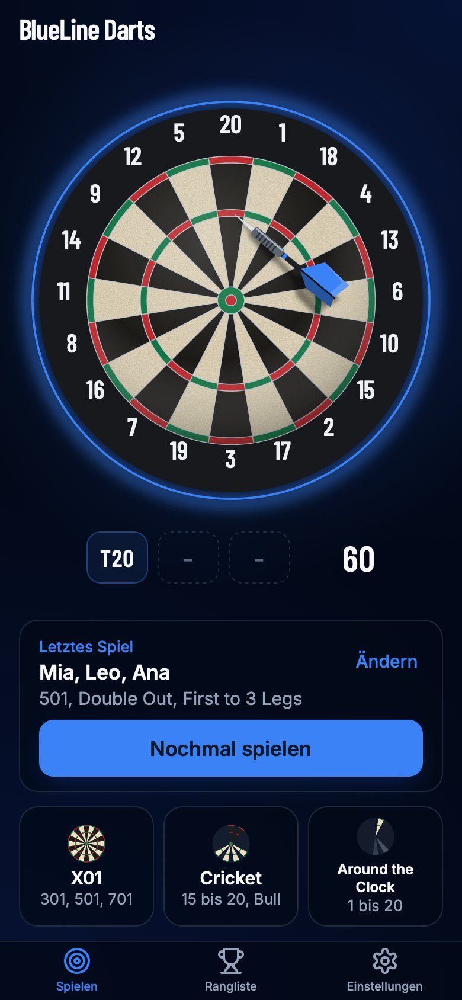
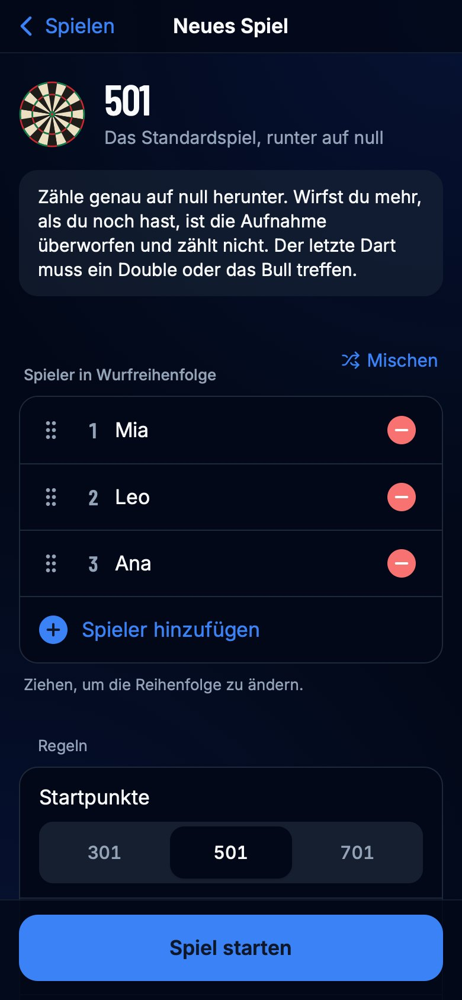
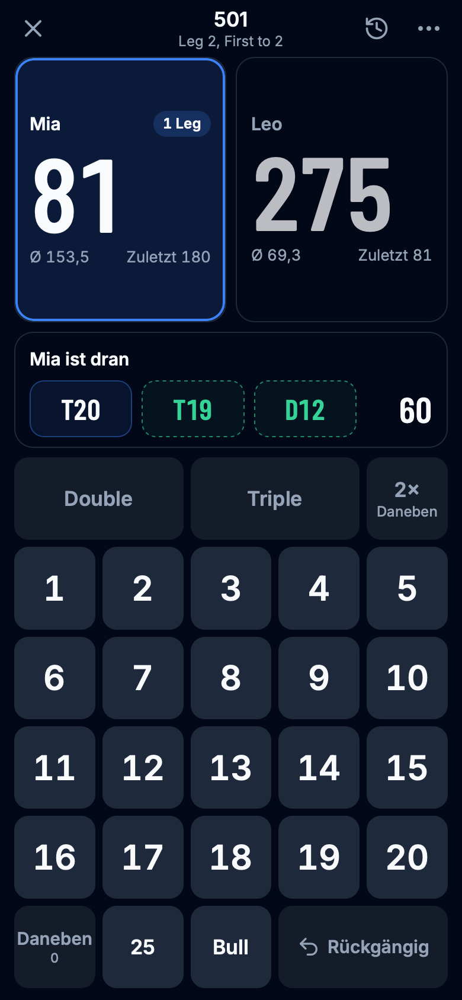
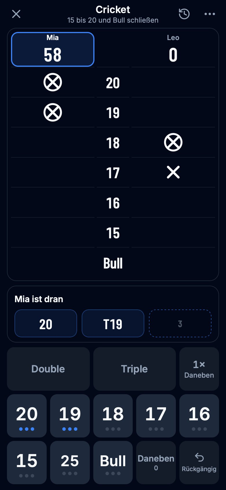
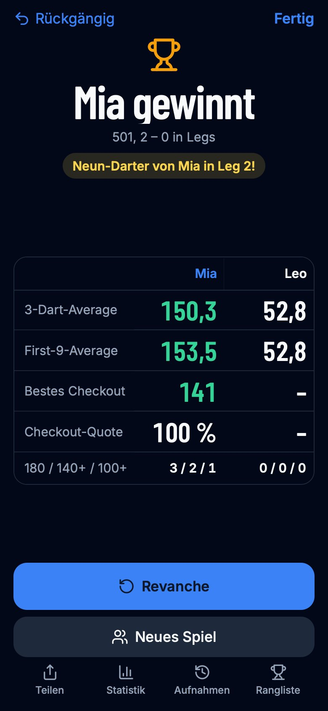
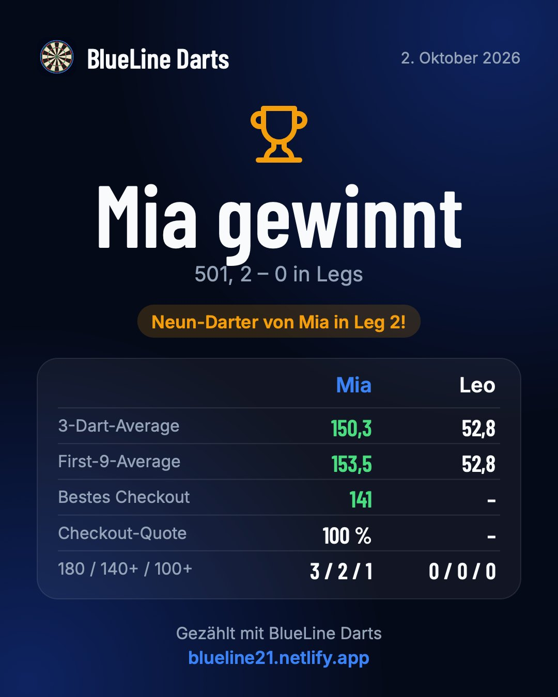
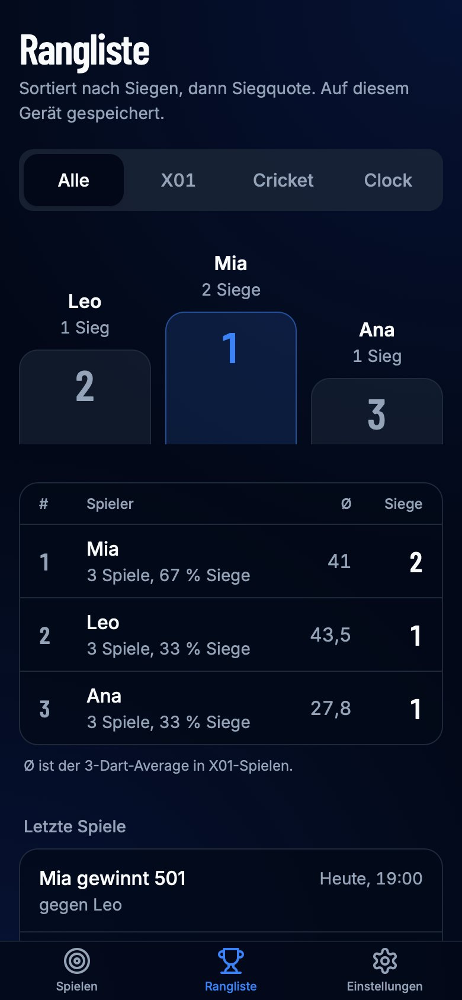
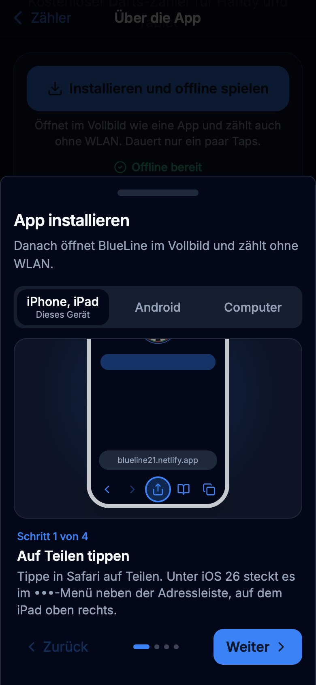
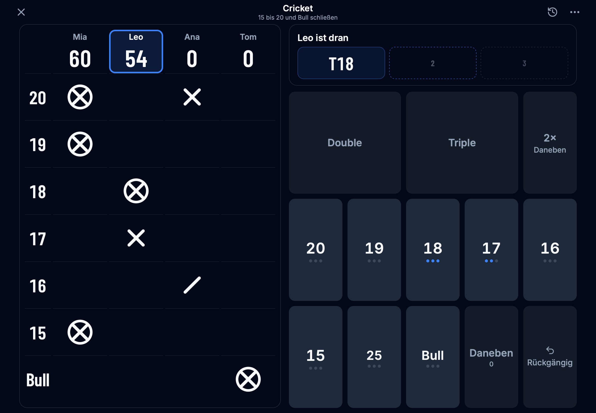

# BlueLine Darts

A free dart scorer for phones and tablets: 501, 301 and 701, Cricket and Cut Throat Cricket, and Around the Clock, for 1 to 6 players. It shows checkout routes, lets you correct any dart at any time, keeps stats and a leaderboard, and installs to the home screen to keep score offline.

Live: https://blueline21.netlify.app

The app speaks German and English. It follows the device's language and falls back to German, the standard; Settings can pick one.

Made by [DrShift](https://github.com/DoktorShift). DrShift is available for freelance work, from small private projects to bigger ones.

## Screenshots

<table>
  <tr>
    <td align="center" valign="top" width="25%"><br><sub>Last game again in one tap</sub></td>
    <td align="center" valign="top" width="25%"><br><sub>Setup remembers your rules</sub></td>
    <td align="center" valign="top" width="25%"><br><sub>Checkout route in the empty slots</sub></td>
    <td align="center" valign="top" width="25%"><br><sub>Cricket, like a chalkboard</sub></td>
  </tr>
  <tr>
    <td align="center" valign="top"><br><sub>One result screen, ready to share</sub></td>
    <td align="center" valign="top"><br><sub>The picture players share</sub></td>
    <td align="center" valign="top"><br><sub>Leaderboard</sub></td>
    <td align="center" valign="top"><br><sub>Install guide for offline play</sub></td>
  </tr>
</table>

<p align="center"><br><sub>Cricket for four on an iPad</sub></p>

## What it does

- **Games:** X01 (301, 501, 701) with Double In, Double Out, legs and sets; Cricket with an optional Cut Throat rule; Around the Clock, optionally finishing on the bull.
- **Entering scores:** dart by dart on a keypad, or the visit total. "2× Daneben" fills the rest of a visit with misses.
- **Mistakes:** tap any dart, of any visit, to correct it; undo steps back one dart; the wrong thrower or starter is one tap on their score.
- **One fixed screen** per game from an iPhone SE to a 13" iPad, portrait and landscape, for 1 to 6 players. Nothing scrolls while you play.
- **After the game:** the key numbers per player, Rematch, the full stats in a sheet, and a picture of the result to share.
- **Play again:** the Play tab starts last game's players and rules in one tap, and setup remembers the rules for each kind of game.
- **Offline:** installs to the home screen like an app. Games, settings and the leaderboard stay on the device; there is no account, no ads and no tracking.

## Run it

Requires Node.js 22.18 or newer.

```sh
npm install
npm run dev        # http://localhost:3000
```

Production build:

```sh
npm run build
npm start
```

## Check it

```sh
npm run lint       # ESLint (Next.js rules)
npm run typecheck  # TypeScript, also enforced by npm run build
npm test           # rules engine, Double In and sets, corrections, checkout routes, texts (node:test)
```

CI runs all of these plus a production build on every push (`.github/workflows/ci.yml`).

## Devices

Made for phones and tablets first. Needs iOS/iPadOS 16 or newer, or a current Chrome, Edge or Firefox (the layout uses CSS container queries).

## Deploy

Netlify builds the app from `netlify.toml` (`npm run build`, Next.js runtime, Node 22). Page metadata, the sitemap, robots.txt and llms.txt use the site address Netlify provides at build time (`URL`); set `SITE_URL` to override it.

## Findability and sharing

| File | What it's for |
| --- | --- |
| `lib/site.ts` | Name, address, author and source code link, used everywhere below |
| `lib/metadata.ts` | Title, description, canonical URL, Open Graph and Twitter cards for each page |
| `lib/structured-data.ts` | schema.org data: the web app, the website and its author |
| `app/robots.ts`, `app/sitemap.ts` | `/robots.txt` and `/sitemap.xml` |
| `app/llms.txt`, `app/llms-full.txt`, `lib/llms.ts` | Guides for AI assistants (llmstxt.org) |
| `app/about/page.tsx` | About page: install for offline play, rules, questions and the maker |
| `public/social/` | Share pictures in German and English, see below |
| `public/humans.txt` | Credits |

Share pictures in `public/social/`, each as `-de.jpg` and `-en.jpg`:

| Size | Use |
| --- | --- |
| `blueline-darts-1200x630` | Link previews: Facebook, X, LinkedIn, WhatsApp, Slack, iMessage (set as Open Graph and Twitter image) |
| `blueline-darts-1200x1200` | Square posts and small previews: Instagram, Facebook, Reddit thumbnails (also in Open Graph) |
| `blueline-darts-1080x1350` | Instagram and Facebook portrait posts |
| `blueline-darts-1080x1920` | Stories and reels covers: Instagram, Facebook, TikTok, WhatsApp status |
| `blueline-darts-1600x900` | 16:9 posts: Reddit, X, YouTube community |

## Where things are

| Path | What it does |
| --- | --- |
| `lib/game/engine.ts` | The rules. A game is a log of throws; every screen state is rebuilt by replaying it, so undo, resume and corrections all use the same code. Double In and sets live here too. |
| `lib/game/rules.ts` | The three kinds of game, their options, and the rules setup remembers. |
| `lib/game/checkout.ts` | Checkout routes for the darts left. |
| `lib/game/words.ts` | A game in words: leg names, the rules line, the line under the title. |
| `lib/i18n/` | Texts: `de.ts` is the master catalog, `en.ts` must match it (TypeScript checks every entry). |
| `components/game/use-match-controller.ts` | Entering darts, undo, corrections and turn changes for a running game. |
| `components/game/` | Game screen, scoreboards, keypads, visit panel, sheets, leg and result screens. |
| `lib/result-image.ts` | Draws the result picture players share. |
| `lib/board-geometry.ts` | Dartboard geometry, shared by the board, tap-to-score and the app icons. |
| `app/manifest.ts`, `app/icon.tsx`, `app/apple-splash/`, `public/sw.js` | Home-screen install: manifest, generated icons and iOS launch screens, offline service worker. |
| `docs/screenshots/` | The screenshots in this README. |
| `tests/` | Unit tests. |

Everything is saved on the device (localStorage): the game in progress, settings, the last game, remembered rules and the leaderboard. Saved data that can't be read is dropped quietly instead of showing an error.
